# proyecto-eapn-portabilidad

## Integrantes

- Ana Paula Duarte
- Steven Gracia Ayala

## Descripción general

Proyecto universitario del Desafío 1: integrador de una EAPN de Portabilidad
Numérica en Paraguay. Implementa un sistema simplificado que registra solicitudes,
valida sus datos, genera y confirma un PIN, consulta la decisión del operador
donante y registra la portación aprobada. Notifica al receptor el resultado del
donante y permite consultar el estado y los hitos de la solicitud.

La integración usa **Java 21, Apache Camel con Java DSL y Spring Boot, Apache
ActiveMQ Artemis mediante JMS, PostgreSQL, WireMock, Gradle Wrapper y Docker Compose**.
Los operadores son simulados: no hay conexión a redes de telefonía ni envío real de SMS.

| Componente | Versión configurada |
| --- | --- |
| Java Toolchain | 21 |
| Gradle Wrapper | 9.6.0 |
| Spring Boot | 3.5.16 |
| Apache Camel | 4.18.3 |
| Artemis en Docker | 2.44.0-alpine (`apache/activemq-artemis`) |
| PostgreSQL en Docker | 17.6 |
| WireMock | 3.13.1 |

Fuentes de configuración: [build.gradle](build.gradle),
[Gradle Wrapper](gradle/wrapper/gradle-wrapper.properties),
[compose.yaml](compose.yaml) y [application.properties](src/main/resources/application.properties).

## Arquitectura de integración

La API conserva un contrato síncrono: espera la respuesta del consumidor JMS.
Las tres llamadas a operadores pasan por Artemis. Los servicios validan y
persisten; las rutas Camel adaptan HTTP, JMS y los contratos de los mocks.

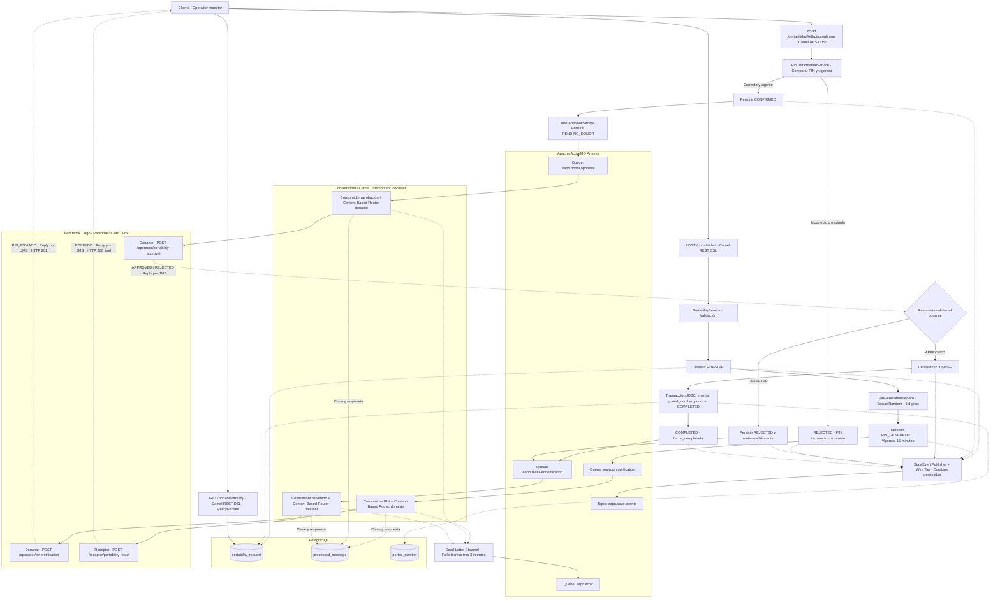

Las transiciones se guardan en `portability_request`; las líneas hacia la base
resumen las escrituras para mantener legible el diagrama. La confirmación es una
**segunda petición del cliente**: WireMock confirma el envío simulado, pero no
confirma el PIN en nombre del titular. El rechazo por PIN termina esa petición
con HTTP 400; la notificación final al receptor pertenece al flujo de decisión
del donante. La llamada externa al receptor ocurre después del commit JDBC.

## EIPs implementados

| Patrón | Problema que resuelve | Dónde se aplica | Justificación |
| --- | --- | --- | --- |
| Content-Based Router | Seleccionar el operador destinatario | `OperatorRouter`, rutas `direct:seleccionar-donante` y `direct:seleccionar-receptor` | `choice/when` reconoce Tigo, Personal, Claro y Vox y establece el header del rol correspondiente. |
| Request-Reply | Esperar y validar la confirmación o decisión externa | `MessagingGatewayRoute`, consumidores JMS y adaptadores HTTP | La API espera un `OperatorReply`; el donante responde APPROVED/REJECTED con correlación validada. |
| Correlation Identifier | Asociar respuestas y diagnósticos a una solicitud | `JMSCorrelationID = request_id`, DTOs y validaciones de consumidores/HTTP | Evita aplicar una respuesta que corresponde a otra solicitud. |
| Idempotent Receiver | Evitar repetir integraciones por mensajes duplicados | `OperatorMessageProcessor` y `ProcessedMessageRepository` | La clave persistente por operación y solicitud permite reutilizar una respuesta ya procesada. |
| Dead Letter Channel | Aislar fallos técnicos después de reintentos limitados | `MessagingConsumerRoute` → `direct:messaging-error` → `eapn.error` | Conserva diagnóstico seguro sin convertir un error técnico en rechazo de negocio. |
| Wire Tap | Observar cambios de estado sin esperar a suscriptores de auditoría | `StateEventPublisher`, `direct:publish-state-event` y `direct:deliver-state-event` | Envía una copia de un DTO seguro al topic, sin copiar el modelo que contiene PIN. |
| Message Channel / JMS | Transportar trabajo entre la API y consumidores | Tres colas de operaciones, topic de estados y cola de errores | Artemis interviene en el procesamiento real de las llamadas a operadores. |

Implementaciones en [route/](src/main/java/py/edu/ucom/is2/eapn/route/),
[messaging/](src/main/java/py/edu/ucom/is2/eapn/messaging/) y
[repository/](src/main/java/py/edu/ucom/is2/eapn/repository/).

## Flujo de estados

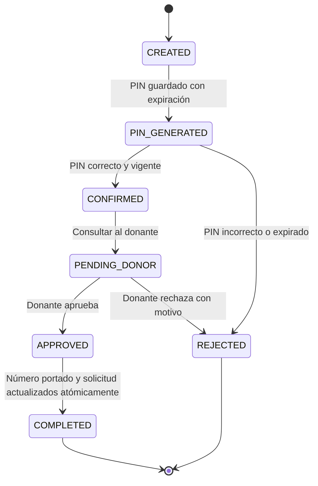

- `PIN_GENERATED` significa que el PIN fue generado y almacenado; no garantiza
  entrega si la integración falla. El PIN tiene seis dígitos, admite ceros iniciales
  y expira a los 15 minutos; `now >= pinExpiracion` se considera expirado.
- Solo `PIN_GENERATED` admite confirmación. Un intento con formato válido y una
  solicitud habilitada incrementa el contador, tanto si confirma como si rechaza.
  PIN malformado o estado incompatible no incrementan intentos.
- Un rechazo del donante conserva su motivo, no inserta `ported_number` y no marca
  COMPLETED. Tanto esa decisión como una portabilidad completada se notifican al receptor.
- Un error técnico no es `REJECTED`: al fallar la aprobación se conserva
  `PENDING_DONOR`; si falla la notificación final se conserva `COMPLETED` o `REJECTED`.
  Un fallo de persistencia al finalizar conserva `APPROVED` mediante rollback.

## Endpoints

Base local: `http://localhost:8080`. Los POST reciben `Content-Type: application/json`.
Los ejemplos usan datos ilustrativos; reemplazar `{id}` por el ID devuelto al crear.

### POST /portabilidad

Request:

```json
{
  "msisdn": "+595971234567",
  "documento_titular": "0012345",
  "operador_donante": "Tigo",
  "operador_receptor": "Personal"
}
```

Respuesta **HTTP 201**, después de confirmar el envío simulado del PIN:

```json
{
  "id": "REQ-20260918-0123456789abcdef0123456789abcdef",
  "msisdn": "+595971234567",
  "operador_donante": "Tigo",
  "operador_receptor": "Personal",
  "estado": "PIN_GENERATED",
  "fecha_creacion": "2026-09-18T10:00:00-03:00"
}
```

Se valida formato móvil `+5959` seguido de ocho dígitos; no se verifica la
existencia del número. El documento no puede estar vacío y admite hasta 50
caracteres después de quitar espacios exteriores. Los operadores deben estar
registrados en la lista de cuatro nombres y ser distintos; se normaliza su escritura.
El ID usa `REQ-YYYYMMDD-<UUID v4 sin guiones>`, con fecha del Clock configurado.

### POST /portabilidad/{id}/pin/confirmar

Request de ejemplo; debe usarse el PIN correspondiente a la solicitud:

```json
{"pin":"000042"}
```

Respuesta **HTTP 200** cuando finalizan la portación y la notificación:

```json
{"id":"REQ-20260918-0123456789abcdef0123456789abcdef","estado":"COMPLETED","mensaje":"Portabilidad completada correctamente"}
```

Si el donante rechaza y el receptor confirma la notificación, devuelve **HTTP 200**:

```json
{"id":"REQ-20260918-0123456789abcdef0123456789abcdef","estado":"REJECTED","mensaje":"Datos del titular no coinciden"}
```

El PIN solo se recibe en el request: **ninguna respuesta pública lo devuelve**.
WireMock no envía SMS; para una demostración local el PIN se obtiene del registro
de prueba en PostgreSQL, no de un endpoint público.

### GET /portabilidad/{id}

Request sin body: `GET /portabilidad/REQ-20260918-0123456789abcdef0123456789abcdef`.
Respuesta **HTTP 200**:

```json
{
  "id": "REQ-20260918-0123456789abcdef0123456789abcdef",
  "msisdn": "+595971234567",
  "operador_donante": "Tigo",
  "operador_receptor": "Personal",
  "estado": "COMPLETED",
  "fecha_creacion": "2026-09-18T10:00:00-03:00",
  "fecha_pin_generado": "2026-09-18T10:00:01-03:00",
  "fecha_pin_confirmado": "2026-09-18T10:01:00-03:00",
  "fecha_completada": "2026-09-18T10:01:01-03:00"
}
```

Las fechas de hitos no alcanzados son `null`. Para `REJECTED` se incluye
`motivo_rechazo` cuando existe. No se exponen PIN, expiración, documento, intentos
ni información JMS. La consulta reutiliza `findById` y no modifica datos.

### Errores HTTP

| Código | Cuándo se usa |
| --- | --- |
| 400 | JSON o datos inválidos; PIN incorrecto o expirado |
| 404 | Solicitud inexistente en consulta o confirmación |
| 409 | Confirmación incompatible con el estado o datos de PIN; cambio concurrente de estado |
| 500 | Error de persistencia o procesamiento |
| 502 | Fallo de integración en creación o confirmación |

Ejemplo de 404:

```json
{"estado":"RECHAZADA","mensaje":"La solicitud de portabilidad no existe."}
```

Ejemplo de 500 al consultar:

```json
{"estado":"ERROR","mensaje":"No se pudo consultar la solicitud."}
```

`RECHAZADA` en una respuesta de error no implica que la solicitud haya cambiado
al estado de negocio `REJECTED`. No se persisten solicitudes de creación inválidas.

## Mensajería Artemis

| Destino | Tipo | Contenido / propósito |
| --- | --- | --- |
| `eapn.pin.notification` | Cola | Solicitar entrega del PIN generado al donante |
| `eapn.donor.approval` | Cola | Solicitar decisión de portabilidad al donante |
| `eapn.receiver.notification` | Cola | Notificar COMPLETED/REJECTED al receptor |
| `eapn.state.events` | Topic | Publicar cambios de estado para suscriptores de auditoría |
| `eapn.error` | Cola | Conservar diagnósticos de fallos técnicos agotados |

Los gateways envían JSON como `TextMessage` persistente usando **Request-Reply JMS**.
Cada comando contiene `request_id`, `msisdn`, `operation`, `operator` y `payload`.
Se usa `JMSCorrelationID = request_id` y un header `operation`. El consumidor
responde mediante `JMSReplyTo` a una cola temporal; el gateway valida la correlación.
Solo el comando de entrega de PIN contiene PIN, porque el donante lo necesita.

El DLC aplica **tres intentos totales**: uno original y dos redeliveries, con
200 ms de pausa. Abarca HTTP no exitoso, timeout, JSON inválido, correlación
incorrecta, estado desconocido y excepciones del consumidor/JDBC. Los reintentos
propios del cliente HTTP están desactivados. Un `REJECTED` válido del donante es
una respuesta de negocio y no dispara el DLC.

Al agotarse los intentos, `eapn.error` recibe `request_id`, `origin`, `operation`,
`summary`, `exceptionType` y `timestamp`. Se omiten cuerpos originales, PIN,
documento, credenciales y mensajes arbitrarios de excepciones. El consumidor
devuelve un error técnico al gateway, que responde HTTP 502. No hay reenvío
automático desde la cola de errores.

Wire Tap publica CREATED, PIN_GENERATED, CONFIRMED, APPROVED, REJECTED —incluido
PIN incorrecto o expirado— y COMPLETED. Cada evento tiene `request_id`, `msisdn`,
`estado`, `timestamp` y `operation: STATE_CHANGED`, sin PIN. PENDING_DONOR se
persiste, pero no se publica como evento en la implementación actual. Un suscriptor
debe estar conectado o mantener una suscripción durable para conservar eventos
cuando esté desconectado; la aplicación no agrega un historial de auditoría propio.

## Idempotencia

`ProcessedMessageRepository` usa la tabla **`processed_message`**. Su clave primaria
es `(operation, request_id)`: el mismo ID puede ejecutar las tres operaciones,
pero no debe repetir una operación ya confirmada.

1. El consumidor intenta insertar la clave; la PK resuelve la exclusión entre instancias.
2. Si obtiene la clave, llama al operador y guarda la respuesta JSON segura.
3. Un duplicado reutiliza la respuesta guardada sin repetir el HTTP.
4. Si otra instancia sigue trabajando, se reintenta la lectura; al agotarse los
   intentos se informa el error sin liberar la clave del otro consumidor.
5. Un fallo propio agotado libera únicamente la clave incompleta, después de
   publicar el diagnóstico. Una respuesta externa exitosa se conserva en el
   Exchange para no repetir HTTP si solo falla su escritura JDBC durante redelivery.

La idempotencia cubre **consumidores JMS**, no nuevos POST del mismo número ni
la repetición completa de la confirmación HTTP. Un cierre abrupto puede dejar
una clave incompleta: requiere revisar el resultado externo antes de liberarla.
No existe garantía de ejecución única distribuida entre HTTP, JMS y PostgreSQL.

## Persistencia

| Tabla | Datos y responsabilidad |
| --- | --- |
| `portability_request` | ID, MSISDN, documento, operadores, estado, PIN y expiración, intentos, fechas del proceso y motivo de rechazo |
| `ported_number` | MSISDN como PK, operador anterior, operador actual y fecha de portación |
| `processed_message` | Operación e ID como PK compuesta, respuesta procesada y fecha de creación; deduplicación JMS |

Los repositories utilizan JDBC con parámetros. Las fechas de negocio usan
`OffsetDateTime`, columnas PostgreSQL `TIMESTAMPTZ` y el Clock de
`America/Asuncion` por defecto.

`PortabilityFinalizationService.finish()` usa `@Transactional` para insertar el
número portado y actualizar COMPLETED con `fecha_completada` de forma atómica.
La notificación externa ocurre después del commit. Si falla la transacción se
conserva APPROVED; si falla la notificación posterior, se conserva COMPLETED.
Un MSISDN ya presente produce error de inserción; no se implementa upsert.

Un fallo técnico al entregar el PIN puede guardarse en `motivo_rechazo` manteniendo
PIN_GENERATED. El GET oculta ese motivo técnico: solo publica motivos de REJECTED.

### Inicialización desde un entorno limpio

[compose.yaml](compose.yaml) monta ambos scripts en `/docker-entrypoint-initdb.d/`:

1. [01-init.sql](docker/postgres/init.sql): crea `portability_request` y `ported_number`.
2. [02-messaging.sql](docker/postgres/messaging.sql): crea `processed_message`.

PostgreSQL los ejecuta automáticamente al inicializar un **volumen nuevo**.
No se requiere aplicar SQL manualmente en una instalación desde cero. Los
volúmenes antiguos sin `processed_message` pueden actualizarse una vez con:

```sh
docker compose exec -T postgresql sh -c 'psql -v ON_ERROR_STOP=1 -U "$POSTGRES_USER" -d "$POSTGRES_DB"' < docker/postgres/messaging.sql
```

No hace falta borrar los volúmenes para ejecutar la aplicación o las pruebas.

## Operadores simulados

WireMock representa a **Tigo, Personal, Claro y Vox**, tanto como donantes como
receptores. Los [mappings](wiremock/mappings/) distinguen el rol con
`X-Operador-Donante` o `X-Operador-Receptor`, establecidos por el Content-Based Router.

| Endpoint de WireMock | Request interno | Respuesta esperada |
| --- | --- | --- |
| `POST /operador/pin-notification` | `request_id`, `msisdn`, `documento_titular`, `pin` | Mismo `request_id`, `estado: PIN_ENVIADO` y mensaje; no devuelve el PIN |
| `POST /operador/portability-approval` | `request_id`, `msisdn`, `documento_titular`, `operador_receptor` | Mismo `request_id`, `estado: APPROVED` o `REJECTED`, `motivo` |
| `POST /receptor/portability-result` | `request_id`, `msisdn`, `estado`, operadores, `fecha_finalizacion`, `motivo` | Mismo `request_id`, `estado: RECIBIDO` |

Las respuestas normales son HTTP 200. Una aprobación tiene `motivo: null`;
un rechazo requiere un motivo no vacío. El documento **`TEST-REJECTED`** activa
únicamente un escenario controlado del mock para simular el rechazo del donante
con `Datos del titular no coinciden`. La creación todavía devuelve PIN_GENERATED:
el rechazo se obtiene después de confirmar correctamente el PIN y consultar al donante.

Los mappings usan `response-template` para correlacionar el ID. Si se modifican
con WireMock ya iniciado, se pueden recargar con `docker compose restart wiremock`.

## Ejecución

Requisitos: JDK 21, Docker y Docker Compose. Se usa Gradle Wrapper; no hace falta
instalar Gradle global. Desde la raíz del repositorio:

```sh
docker compose up -d
docker compose ps
./gradlew bootRun
```

En otra terminal, ejecutar las pruebas:

```sh
./gradlew test
```

En Windows se puede usar `gradlew.bat`. Docker inicia la infraestructura;
`bootRun` inicia la aplicación Spring Boot localmente.

| Servicio | Dirección local |
| --- | --- |
| API EAPN | `http://localhost:8080` |
| PostgreSQL | `localhost:5432`, base `eapn` |
| Artemis JMS | `tcp://localhost:61616` |
| Consola Artemis | `http://localhost:8161/console` |
| WireMock | `http://localhost:8081` |

Las credenciales **exclusivamente de desarrollo** configuradas para PostgreSQL y
Artemis son `eapn` / `eapn_dev`. No se necesitan secretos reales para la demostración.

Variables de entorno: `DB_URL`, `DB_USER`, `DB_PASSWORD`, `ARTEMIS_BROKER_URL`,
`ARTEMIS_USER`, `ARTEMIS_PASSWORD`, `WIREMOCK_BASE_URL` y `APP_TIMEZONE`.
Exportarlas para compartirlas entre Compose y `bootRun`; Spring Boot no carga
`.env` automáticamente. Los timeouts configurables son
`DONOR_APPROVAL_RESPONSE_TIMEOUT_MS` y `RECEIVER_NOTIFICATION_RESPONSE_TIMEOUT_MS`
(5000 ms), y `MESSAGING_REQUEST_TIMEOUT_MS` (60000 ms). El timeout JMS debe superar
los tres intentos HTTP y sus pausas si se cambian estos valores.

### Alcance de recuperación

No se implementan XA ni outbox. Un timeout puede ocurrir después de que el operador
haya procesado una llamada. La recuperación tras una caída entre etapas requiere
revisar la solicitud y el resultado externo; no se debe reproducir ciegamente el
flujo completo. Un reenvío explícito debe respetar el PIN original y su vigencia.
Los eventos son asíncronos y pueden llegar fuera de orden; el estado PostgreSQL
es la referencia. Si Artemis está caído tampoco se puede garantizar escribir
en su cola de errores. Estas limitaciones no convierten fallos técnicos en REJECTED.

## Evidencias

Capturas existentes de la demostración local, enlazadas con rutas relativas.
Las capturas de requests y base de datos muestran PIN de prueba; las respuestas
públicas no lo incluyen. La captura de consola conserva pestañas ajenas a la
aplicación; la evidencia relevante es el panel de Artemis. No hay capturas de
commits ni PRs en esta carpeta.

### Infraestructura Docker

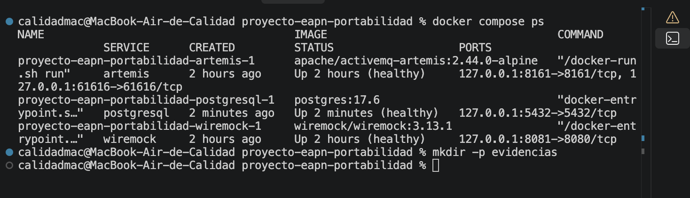

### Ejecución de pruebas Gradle

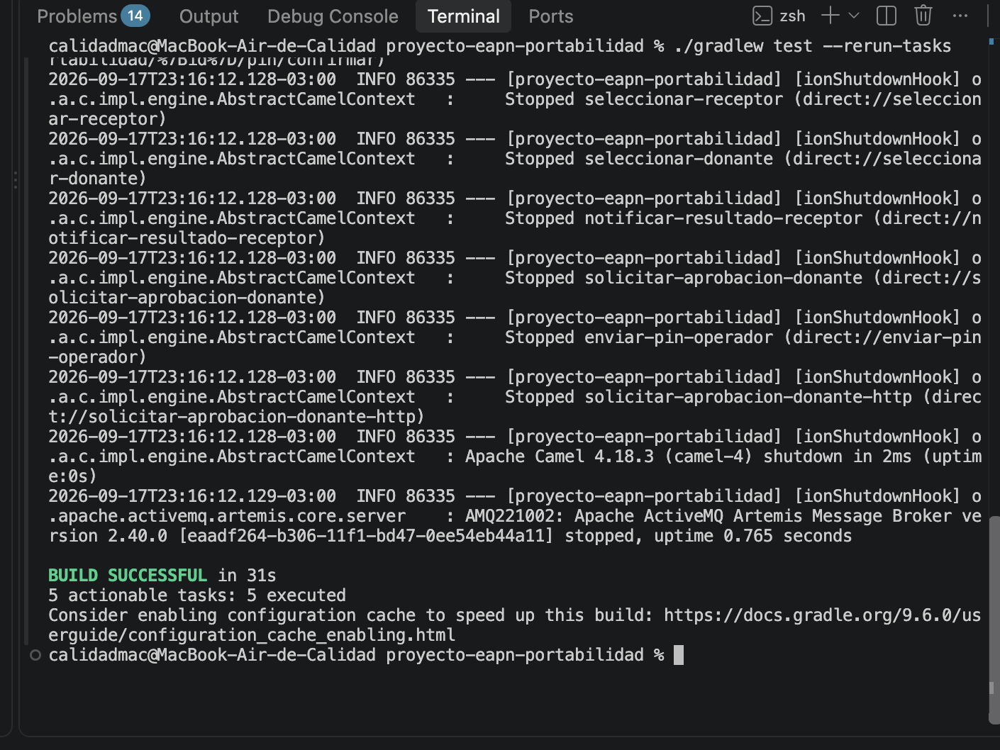

### Creación de solicitud

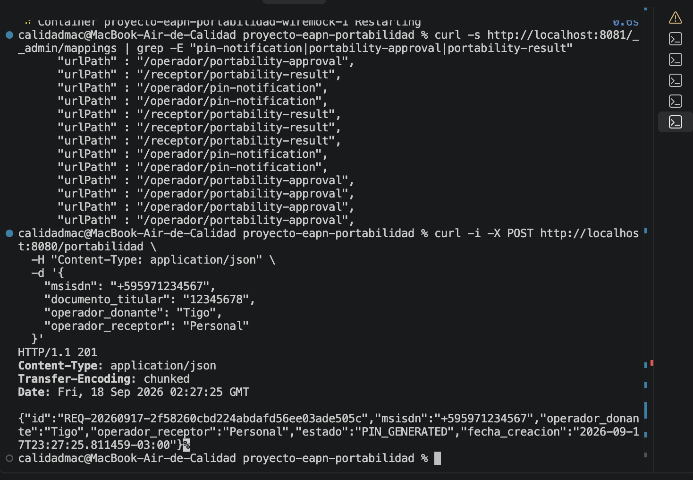

### Persistencia del PIN generado

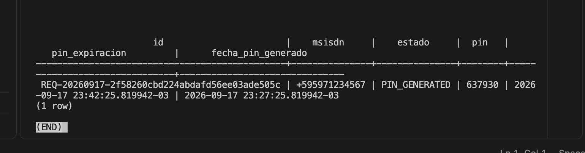

### Confirmación y finalización

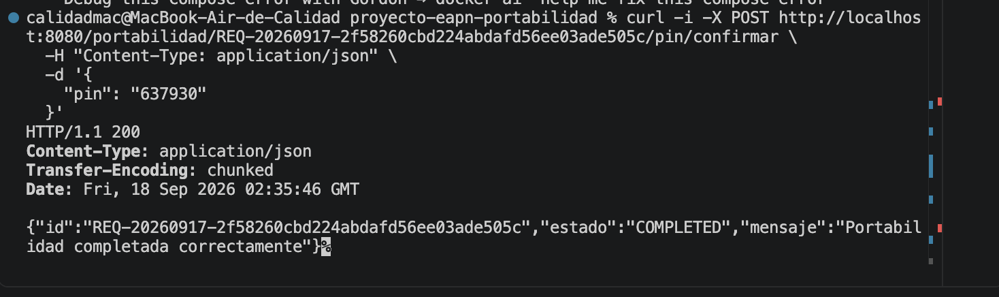

### Consulta de solicitud completada

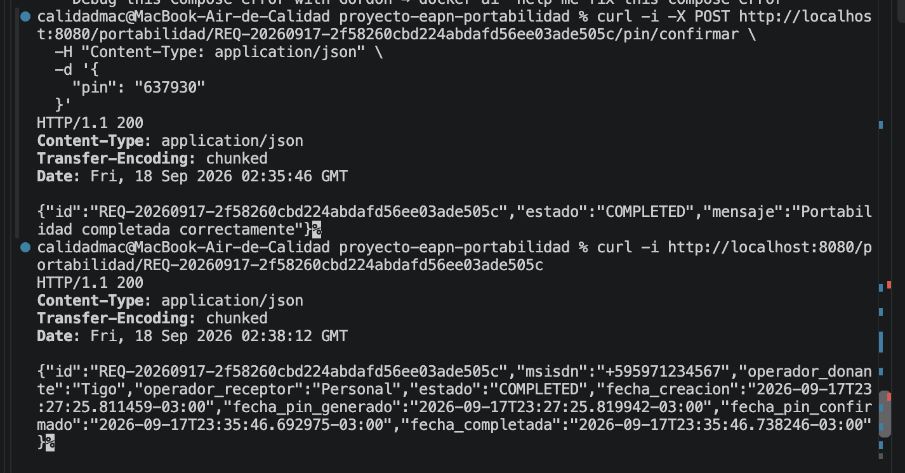

### Número portado

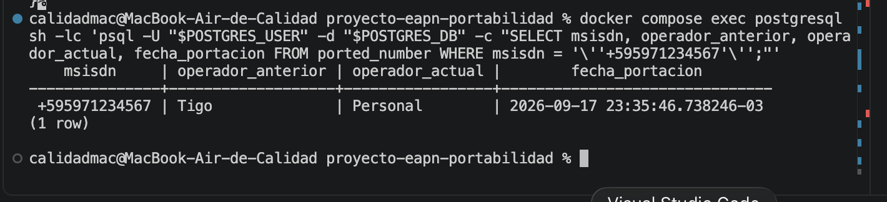

### Canales Artemis

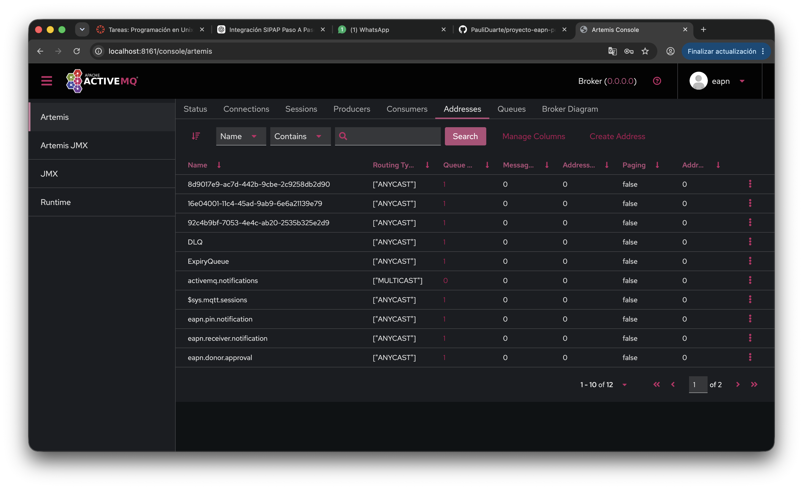

### Creación del escenario de rechazo

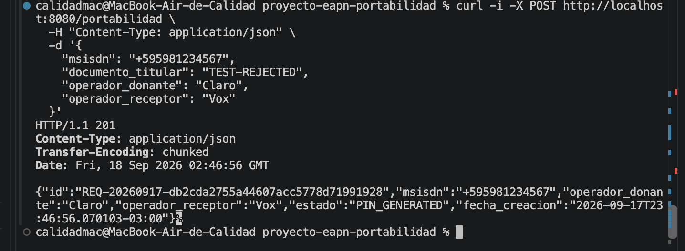

### Rechazo real del donante y consulta

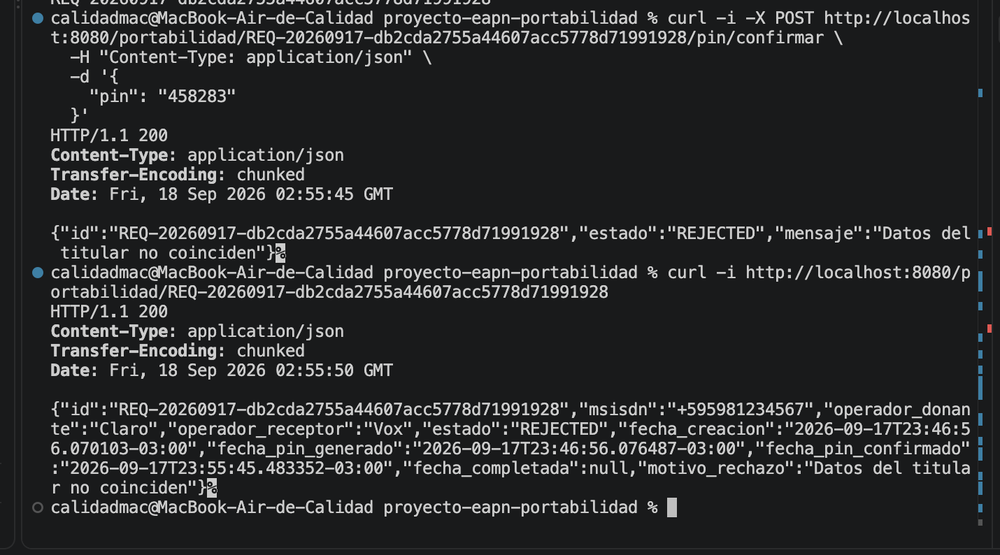

## Pruebas

```sh
./gradlew test --rerun-tasks
docker compose config --quiet
git diff --check
```

La suite cubre validaciones y PIN, repositories, transacciones de finalización,
los tres endpoints, estados de negocio y protección del DTO público. Las pruebas
de mensajería usan Artemis Jakarta 2.40.0 embebido, H2 con JDBC real y WireMock
local: verifican correlación, cuatro operadores, duplicados, redelivery, DLC,
eventos y conservación de estados ante fallos. No dependen de servicios Docker.
Los tests HTTP aislados usan `app.messaging.enabled=false`; la ejecución normal
usa `true`, sin fallback silencioso cuando falla Artemis.

`PostgresInitializationTest` verifica los montajes de Compose y ejecuta los
scripts reales sobre H2 vacío, con un alias para TIMESTAMPTZ. Esta prueba valida
la creación de las tres tablas sin reemplazar una prueba del contenedor PostgreSQL.

Verificación final ejecutada el **18 de septiembre de 2026** con
`./gradlew test --rerun-tasks`: **273 tests, 0 fallos, 0 errores y 0 omitidos**.
Resultado: **BUILD SUCCESSFUL**. El conteo proviene de los reportes XML de esta
ejecución, no de la captura histórica de Gradle. El informe HTML se genera en
`build/reports/tests/test/index.html` y no se versiona.
